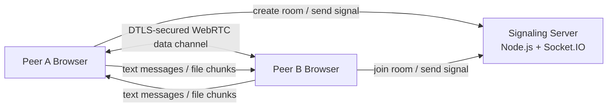

# Secure P2P

<p align="center">
  Premium browser-to-browser file sharing and encrypted collaboration built with Next.js, WebRTC, Socket.IO, and a modern glassmorphism UI.
</p>

<p align="center">
  <a href="https://github.com/Narayan-Kumar-Yadav/Secure-P2P"></a>
  
  
  
</p>

## Overview

Secure P2P is a decentralized file sharing and collaboration application that creates private peer rooms in the browser. Users can generate a room, invite another peer with a code or QR link, chat over an encrypted WebRTC data channel, and transfer very large files without uploading them to a storage server.

The backend is used only for signaling. Actual file and chat data move directly between peers after the WebRTC session is established.
 


## Why This Project Stands Out

- Direct browser-to-browser file transfer using WebRTC data channels
- End-to-end encrypted communication through DTLS-secured peer channels
- Backpressure-safe chunk streaming designed for massive files up to 3GB
- Live collaboration feed with chat messages and file attachments
- Image and video previews before send and inside the in-chat attachment feed
- Instant room joining via sharable links and QR codes
- Responsive glassmorphism UI with transfer progress, toasts, and terminal logs

## Feature Highlights

### Collaboration

- Real-time encrypted text chat
- Custom display names that appear on both sides of the conversation
- In-chat file attachment cards with manual download actions
- Sender and receiver activity reflected in a live collaboration feed

### File Transfer Engine

- Fixed-size 64 KB chunking for reliable streaming
- WebRTC backpressure protection using `bufferedAmount` checks
- Progress updates throttled to avoid excessive UI churn
- Memory-optimized receive flow that keeps chunk buffers out of global Zustand state
- Media previews for selected images and videos before sending

### Room Experience

- Room creation and joining with 6-character codes
- Auto-join support from `?room=XXXXXX`
- QR-based invite flow for faster peer connection
- Prominent E2E encryption status in the connected room UI

## Architecture



### System Design

1. The frontend creates or joins a room through the Socket.IO signaling server.
2. The signaling server exchanges WebRTC offer, answer, and ICE candidate events.
3. Once connected, peers communicate directly through the WebRTC data channel.
4. Chat messages are exchanged as structured control messages.
5. Files are sent as metadata plus binary chunks, then reconstructed into attachments in the collaboration feed.

## Tech Stack

### Frontend

- [Next.js](https://nextjs.org/)
- [React](https://react.dev/)
- [Tailwind CSS](https://tailwindcss.com/)
- [Zustand](https://zustand-demo.pmnd.rs/)
- [Framer Motion](https://www.framer.com/motion/)
- [Simple-Peer](https://github.com/feross/simple-peer)
- [Socket.IO Client](https://socket.io/)
- [react-qr-code](https://github.com/rosskhanas/react-qr-code)

### Backend

- [Node.js](https://nodejs.org/)
- [Express](https://expressjs.com/)
- [Socket.IO](https://socket.io/)

## Repository Structure

```text
Secure-P2P/
|-- backend/                # Signaling server
|   |-- package.json
|   `-- server.js
|-- frontend/               # Next.js application
|   |-- app/
|   |-- components/
|   |-- hooks/
|   |-- public/
|   |-- store/
|   `-- package.json
|-- docs/
|-- package.json            # Root workspace runner
|-- CONTRIBUTING.md
`-- README.md
```

## Current Capabilities

- Secure room creation and 1-to-1 peer joining
- Real-time chat with custom display names
- Massive file transfer flow with progress bars
- File preview and in-chat attachment rendering
- QR sharing for rooms
- Clean local workspace startup with frontend and backend together

## Local Development

### Prerequisites

- [Node.js](https://nodejs.org/) 18 or later
- npm

### Clone the Repository

```bash
git clone https://github.com/Narayan-Kumar-Yadav/Secure-P2P.git
cd Secure-P2P
```

### Install Dependencies

```bash
npm install
cd frontend
npm install
cd ../backend
npm install
cd ..
```

### Run the App

```bash
npm run dev
```

This starts:

- the Next.js frontend on `http://127.0.0.1:3000`
- the Node.js signaling server on `http://127.0.0.1:4000`

### Fallback: Run in Two Terminals

Terminal 1:

```bash
cd frontend
npm run dev
```

Terminal 2:

```bash
cd backend
npm run dev
```

## Environment Variables

For local development, the frontend falls back to `http://127.0.0.1:4000` automatically.

For hosted environments, define:

```bash
NEXT_PUBLIC_SIGNALING_SERVER=https://your-signaling-server.example.com
```

See [docs/DEPLOYMENT.md](docs/DEPLOYMENT.md) for deployment guidance.

## Deployment Notes

The best production setup for this app is:

- Frontend: Vercel
- Signaling backend: Render or Railway

This is important because the signaling layer uses a persistent Socket.IO server, which is a better fit for a long-running Node host than a purely serverless setup.

## Quality and Stability Improvements Already Implemented

- Data channel control messages are safely decoded even when `simple-peer` sends them as binary
- Chunk sending respects WebRTC backpressure before writing more data
- Receiver memory is optimized by storing incoming binary chunks in a ref instead of Zustand
- File transfers no longer auto-download; they appear as manual-download attachments in chat
- Hydration mismatch handling improved for browser-extension-injected attributes
- Local Windows dev setup stabilized for `127.0.0.1:3000` and `127.0.0.1:4000`

## Roadmap

- Multi-peer room support
- Drag-and-drop batch uploads
- Better reconnect and interrupted-transfer recovery
- Dedicated deployment presets for frontend and backend
- Automated tests for signaling and transfer flow

## Contribution Guide

If you want to contribute, start with [CONTRIBUTING.md](CONTRIBUTING.md).

## Author

**Narayan Kumar Yadav**

- GitHub: [@Narayan-Kumar-Yadav](https://github.com/Narayan-Kumar-Yadav)
